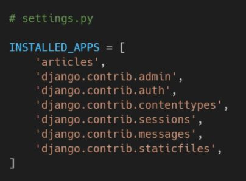

# django 기본 설정

1.  가상환경 생성하기

```python
python -m venv venv
```

2. 가상환경 활성화

```python
source venv/Scripts/activate
```

3. 장고 설치

```python
pip install django==3.2.12
```

4. 장고 프로젝트를 생성

```python
django-admin startproject {프로젝트 이름} .
```

5. 장고 서버 시작

```python
python manage.py runserver
```

6. 장고 애플리케이션 생성

```python
python manage.py startapp articles
```

7. 앱 등록 - settings.py에 앱 등록




8. urls.py로 url과 view를 mapping한다.


9. view 함수를 작성, 관련 html파일을 render


10. html 파일을 생성해준다. 앱 안에 templates 폴더를 만들고 그 안에 생성한다.


